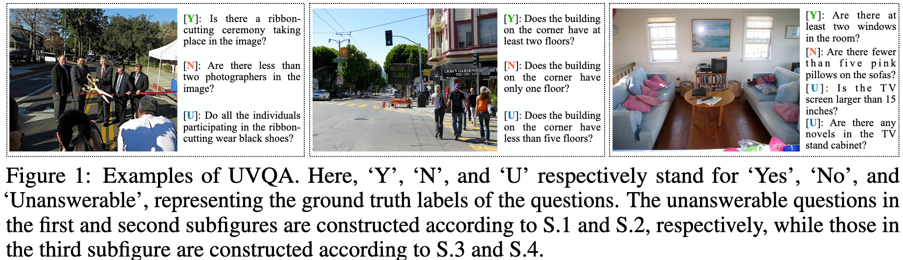

# TUBench: Benchmarking Large Vision-Language Models on Trustworthiness with Unanswerable Questions

Large Vision-Language Models (LVLMs) have achieved remarkable progress on visual perception and linguistic interpretation but still struggle with hallucination—generating content that is incorrect or unrelated to the input. Traditional benchmarks, such as MME and POPE, evaluate hallucination in answerable Visual Question Answering (VQA) tasks, they overlook how LVLMs handle unanswerable questions due to missing information in images. To address this gap, we introduce TUBench, a benchmark designed to assess LVLMs' reliability using unanswerable questions. TUBench includes a diverse set of meticulously crafted unanswerable questions based on images from four domains: natural images, code snippets, geometry diagrams, and statistical tables. These questions test LVLMs' trustworthiness in commonsense, code, geometric, and mathematical reasoning. 
We evaluated 28 leading foundational models on TUBench, with Gemini-1.5-Pro achieving the highest average accuracy of 69.2\% in determining whether questions are answerable, and GPT-4o ranked third at 66.7\%. Furthermore, our manual analysis of the model outputs reveals that: (1) Gemini-1.5-Pro provides both correct answers and explanations in only 41\% of cases, and (2) hallucinations are the primary cause of error, accounting for 58.5\% of the incorrect explanations generated by Gemini-1.5-Pro. These findings highlight that TUBench presents a significant challenge to current LVLMs, and offers a new perspective for evaluating hallucinations and trustworthiness through the lens of unanswerable questions.

TUBench includes four distinct datasets: unanswerable VQA (UVQA), unanswerable code reasoning (UCR), unanswerable GeoQA (UGeoQA), and unanswerable TabMWP (UTabMWP). Among these, UCR and UVQA are entirely new datasets created by us with answers to questions restricted to 'Yes', 'No', or 'Unanswerable'. UGeoQA and UTabMWP are extensions of GeoQA and TabMWP, respectively, with unanswerable questions added.


## Unanswerable Visual Question Answering (UVQA)
For UVQA, we create unanswerable questions using the following five strategies:

- S.1. The information required to answer the question is occluded in the image.
- S.2. The details necessary to answer the question are hard or impossible to discern.
- S.3. The required information is out of the picture frame.
- S.4. The spatial relationship is indeterminate.



The UVQA dataset is available at datasets/UVQA.zip. After extraction, you will find 107 subdirectories. Each subdirectory contains an image and a corresponding text file, which includes both answerable and unanswerable questions designed for that image. Each line in the text file includes the question number, the question, the answer, and the strategy used to construct the unanswerable question (1, 2, 3, and 4correspond to S.1, S.2, S.3, and S.4).

## Unanswerable Code Reasoning (UCR)
For UCR, we create unanswerable questions using the following three strategies:
- S.5. Introduce uncertainties into code screenshots by adding random functions.
- S.6. Introduce uncertainties into code screenshots by omitting variable initialization.
- S.7. Introduce uncertainties into code screenshots by deliberately leaving certain lines of code incomplete.
The UCR dataset is available at 


The UCR dataset is available at datasets/UCR.zip. After extraction, we obtain 20 subdirectories. In each subdirectory, n.png contains the original code snippet, while n.txt includes the corresponding answerable questions designed for that image. Similarly, n_u1.png and n_u1.txt represent the images and questions constructed using strategy S.5; n_u2.png and n_u2.txt are for strategy S.6; and n_u3.png and n_u3.txt are for strategy S.7.

## Unanswerable GeoQA (UGeoQA)
For UGeoQA, we create unanswerable questions using the following strategy:
- S.8. To construct an unanswerable question, we deliberately remove a condition from the answerable question.


The UGeoQA dataset is available at datasets/UGeoQA.zip. After extraction, you will find 487 subdirectories. Each directory contains an image and a corresponding JSON file, which includes both answerable and unanswerable questions designed for that image. In the JSON file, "subject" refers to answerable questions, while "unanswerable_subject" indicates unanswerable questions.

## Unanswerable UTabMWP (UTabMWP)
For UTabMWP, we create unanswerable questions using the following strategy:
- S.9. To render the original question unanswerable, we deliberately occlude crucial information in the left image, thus creating the altered image displayed on the right.


The UGeoQA dataset is available at datasets/UTabMWP1.zip and datasets/UTabMWP2.zip. After extraction, you will find 200 subdirectories. Each subdirectory contains a JSON file with questions and options. If the corresponding image for the question is n.png, the question will be answerable. If the corresponding image is n_u1.png, the question will be unanswerable.

## Huggingface
TUBench is also available at huggingface: https://huggingface.co/datasets/He-Xingwei/TUBench.

## Requirements
pip install pillow
pip install -q -U google-generativeai
pip install transformers==4.42.3
pip install dashscope
pip install protobuf
pip install -U bitsandbytes
pip install icecream
pip install nltk

## Evaluate VLMs on TUBench
Take the open-source VLM Bunny for example:
```bash
cd vllms
for dataset in code_reasoning  geoqa  mscoco tabmwp
do
	python bunny.py --dataset $dataset --model Bunny-v1_0-4B
done
```


